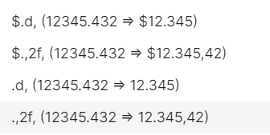

# Apache Superset
Modificaciones sobre Apache Superset v2.0 para darle soporte a la Argentina en el chart Country Map, cambios de locale para formatos de números y monedas que se ajusten a los utilizados en el país y algunas visuales para mantener la estética de Argentina.gob.ar.
Los formatos de números son 



Tambien tiene un path custom en /mapa con una vista pública de datos.

# Uso
1) iniciar submodule de superset `git submodule update --init`
2) modificar `superset_config.py` a gusto
3) para iniciarlo `docker-compose up -d`
4) ejecutar en el container
```bash
superset db upgrade
export FLASK_APP=superset
superset fab create-admin
superset init
```
5) apuntar reverse proxy a 127.0.0.1:8088

# Dev
Para hacer cambios sobre la codebase de superset se usa el compose que viene.
1) iniciar submodule de superset `git submodule update --init`
2) `cd superset` y usar el Dockerfile de ahí. Seguir las [instrucciones de la documentación](https://superset.apache.org/docs/installation/installing-superset-using-docker-compose/).
